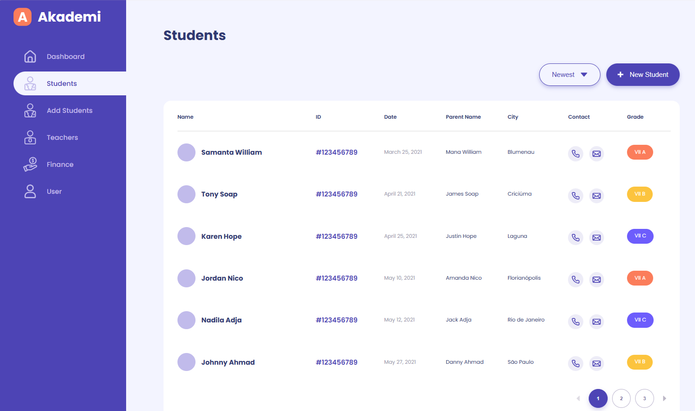

# 🎓 Akademi Project

O Akademi Project é uma aplicação front-end desenvolvida em React, HTML e CSS, criada como parte de um teste técnico enviado pela empresa para avaliação de habilidades em Desenvolvimento Front-end.

---

## ✅ Resultado

O proejto conta com uma interface dividida em seções temáticas, incluindo:
Formulário de cadastro de estudantes (inputs, validações visuais e contador de caracteres)
Seção de informações dos pais (campos estilizados, botões e opções de seleção com radio buttons customizados)
Seção de ações (botões interativos com microanimações de clique e sombra difusa)
Todas as seções seguem o mesmo design system, respeitando hierarquia de componentes e padrões de cor e tipografia definidos para a marca.

## ⚙️ Funcionalidades

- Formulário de cadastro de estudantes com campos organizados em grid
- Contador de caracteres dinâmico no campo de endereço
- Botões com microinterações (efeito de clique e sombras suaves)
- Campos de seleção (radio buttons) totalmente customizados via CSS
- Layout consistente entre seções e estrutura semântica organizada

## 🔧 Melhorias Futuras

- Adicionar conteúdo às novas páginas do sistema
- Implementar a funcionalidade completa dos botões (ex: salvar, cancelar, voltar)
- Tornar o botão de paginação totalmente funcional
- Adicionar validações de formulário com feedback visual ao usuário
- Tornar o layout 100% responsivo para telas menores

---

## 👩‍💻 Autora

Feito por Vanessa do Nascimento da Silva
Desenvolvedora Front-end

## 💬 Agradecimento

Muito obrigada pela oportunidade de demonstrar minhas habilidades em desenvolvimento front-end por meio deste teste.
Estou em busca de uma oportunidade para crescer profissionalmente, contribuir com projetos reais e continuar evoluindo como desenvolvedora.
Fazer este projeto foi um passo importante nesse caminho, e me deixou ainda mais empolgada com o que posso construir e aprender junto a uma boa equipe. 💜
